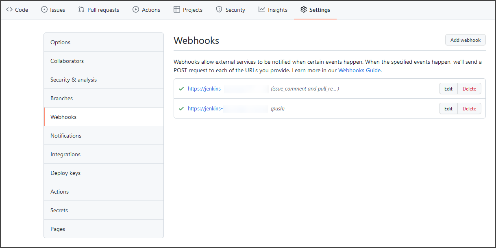
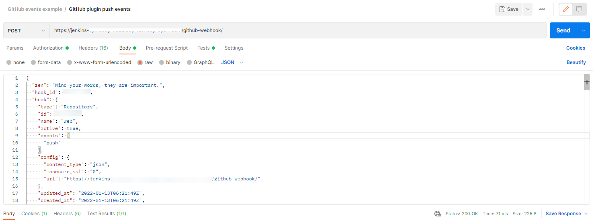
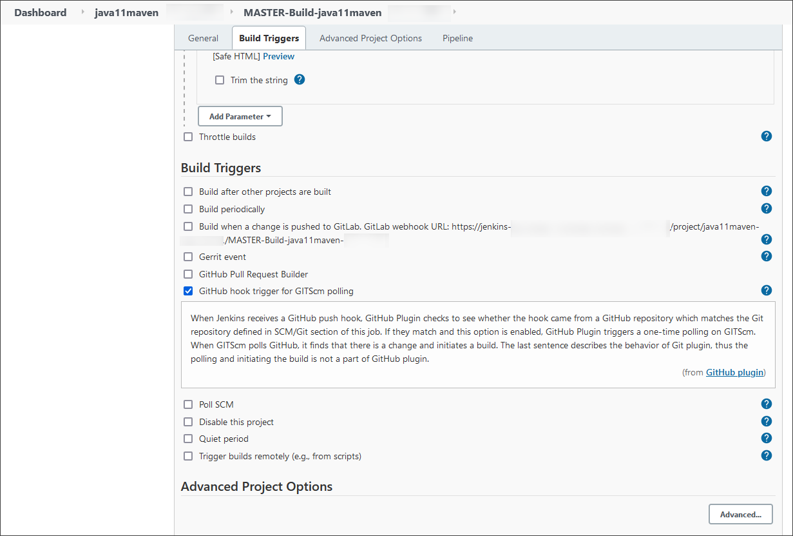
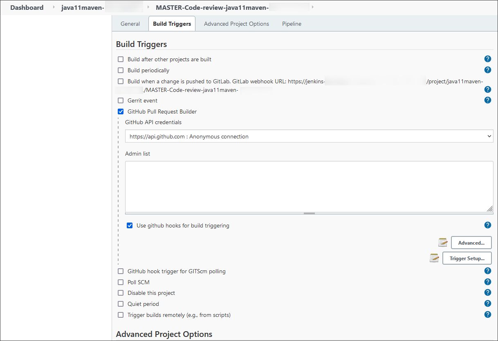

# Debug GitHub Webhooks in Jenkins

A webhook enables third-party services like GitHub to send real-time updates to an application. Updates are triggered by an event or an action by the webhook provider (for example, a push to a repository, a Pull Request creation), and pushed to the application via HTTP requests (namely, Jenkins). 
The GitHub Jenkins job provisioner creates a webhook in the GitHub repository during the **Create release** pipeline once the [VCS Import Strategy](import-strategy.md) is enabled and the [GitHub Integration](github-integration.md) is completed.

The Jenkins setup in EDP uses two following plugins responsible for listening on GitHub webhooks:

* [GitHub](https://plugins.jenkins.io/github/) plugin is configured to listen on Push events.

* [GitHub Pull Request Builder](https://plugins.jenkins.io/ghprb/) is configured to listen on Pull Request events.

In case of any sort of issues with webhooks, make sure that:

1. Firewalls are configured to accept incoming traffic from the IP address range that is described [here](https://docs.github.com/en/authentication/keeping-your-account-and-data-secure/about-githubs-ip-addresses).

2. The job ran at least once before the hook will work (once an application is created in EDP, the build job should be run automatically in Jenkins).

3. Both webhooks (_Push_ and _issue comment_ and _Pull Request_) are created on the GitHub side (GitHub does not need separate webhooks for each branch unlike GitLab):
  * Go to the GitHub repository - > Settings -> Webhooks.

  !

4. Click each webhook and check if the event delivery is successful.
  * The URL payload should be as follows: 
  https://jenkins-the-host.com/github-webhook/ is for the GitHub plugin and https://jenkins-the-host.com/ghprbhook/ is for the GitHub Pull Request Builder.
  * The content type should be **application/json** for Push events and **application/x-www-form-urlencoded** for Pull Request events.
  * The *html_url* in the **Payload** request should match the repository URL.
  * The event can also be redelivered by clicking the **Redeliver** button.

  !

  !!! Note
      It may be convenient to debug webhooks with tools like Postman. 
      Make sure to add all the headers to Postman from the webhook **Request** -> **Headers** field and send the payload (Request body) using the appropriate content type. 

  **Examples for Push and Pull Request events**:

  !
   The response in the Jenkins log: 
     `Jan 17, 2022 8:51:14 AM INFO org.jenkinsci.plugins.github.webhook.subscriber.PingGHEventSubscriber onEvent` 
     `PING webhook received from repo <https://github.com/user-profile/user-repo>!` 

  !
   The response in the Jenkins log: 
     `Jan 17, 2022 8:17:53 AM FINE org.jenkinsci.plugins.ghprb.GhprbRootAction` 
     `Got payload event: ping` 

5. The repo pushing to Jenkins, the GitHub project URL in the project configuration, and the repo(s) in the pipeline Job have to line up.

6. **GitHub hook trigger for GITScm polling** is enabled for the Build job.

  !

7. **GitHub Pull Request Builder** is enabled for the Code Review job.

  !

8. It is convenient to filter through Jenkins log by using Jenkins custom **Log Recorder**.
  * Go to Manage Jenkins -> System Log -> Add new log recorder
  * The Push events for the GitHub:

    | Logger | Log Level |
    | ------ | --------- |
    | org.jenkinsci.plugins.github.webhook.subscriber.DefaultPushGHEventSubscriber | ALL |
    | com.cloudbees.jenkins.GitHubPushTrigger | ALL |
    | com.cloudbees.jenkins.GitHubWebHook | ALL |
    | org.jenkinsci.plugins.github.webhook.WebhookManager | ALL |
    | org.jenkinsci.plugins.github.webhook.subscriber.PingGHEventSubscriber | ALL |

  * The Pull Request events for the GitHub Pull Request Builder:

    | Logger | Log Level |
    | ------ | --------- |
    | org.jenkinsci.plugins.ghprb.GhprbRootAction | ALL |
    | org.jenkinsci.plugins.ghprb.GhprbTrigger | ALL |
    | org.jenkinsci.plugins.ghprb.GhprbPullRequest | ALL |
    | org.jenkinsci.plugins.ghprb.GhprbRepository | ALL |

  !!! Note
      Here is a small example on how to use *Pipeline script* with webhooks for the GitHub plugin (it is already implemented in the EDP pipelines):

          properties([pipelineTriggers([githubPush()])])

          node {
              git credentialsId: 'github-sshkey', url: 'https://github.com/someone/something.git', branch: 'master'
          }

      Push events may not work correctly with the Job *Pipeline script from SCM* option in the current version of the GitHub plugin 1.34.1

### Related Articles

* [Enable VCS Import Strategy](import-strategy.md)
* [GitHub Integration](github-integration.md)
* [Manage Jenkins CI Pipeline Job Provision](manage-jenkins-ci-job-provision.md)
* [GitHub plugin](https://plugins.jenkins.io/github/)
* [GitHub Pull Request Builder](https://plugins.jenkins.io/ghprb/)